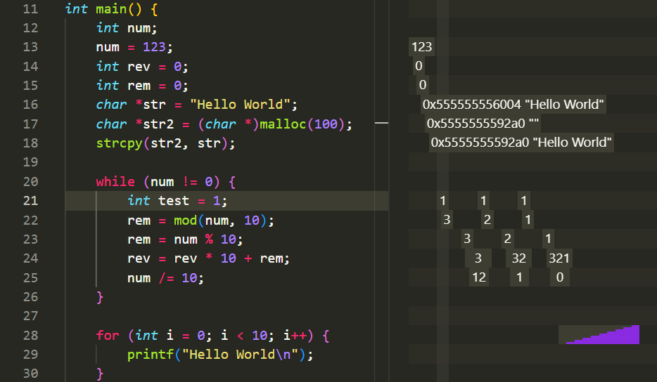

# gdb-execution-visualizer

A visual studio code extension with a python script to record the execution of a c program and visualize it in vscode

## Requirements

- Python 3.x
- GDB
- GCC/c compiler

#### GDB

should be compiled for use with python, check

```bash
gdb --configuration
```

for

```
--with-python=/usr
```

## Usage

Compile the file with (the executable should be named `a.out`)

```
gcc -g file.c
```

Record with

```
gdb -x main.py
```

move the history.json into the `.vscode` folder
run using `Show History`

## Results



## License

[Apache](https://choosealicense.com/licenses/apache-2.0/)
